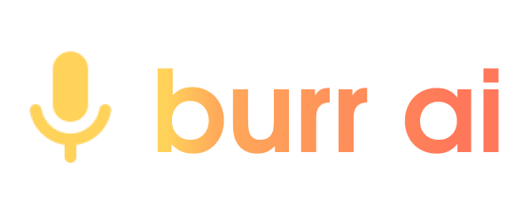

**BurrAI** — бесплатное приложение с открытым исходным кодом, разрабатываемое на движке [Godot Engine](https://godotengine.org/). BurrAI помогает пользователям исправить деффекты речи и улучшить дикцию

# Над проектом работали

**Облачные** — небольшая инди-команда, специализирующая на играх и приложениях. Вы можете следить за нами и нашими дальнейшими проектами в социальных сетях:
[VK](https://vk.com/oblachnye)

**Math Team** — небольшая команда, специализирующая на математике и машинном обучении. Вы можете следить за нами в социальных сетях:
[Telegram](https://t.me/MathIsLifestyle)
